# AI Operations Hub — Prospecting, CRM & Voice Automation

Production B2B operations platform: acquisition campaigns, operational CRM, source-aware
enrichment, and an AI voice agent that turns calls into order drafts, tasks, refund cases and
human handoffs.

**Role**
Application architecture · Prospecting and enrichment · Data provenance · Operational CRM · Voice operations · Adapter integrations

**Status**
In production

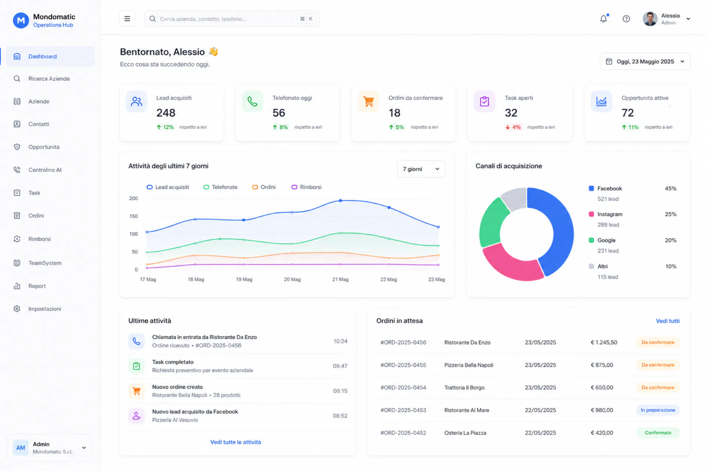

The product sits above existing ERP / management software.

---

## Architecture


Domains: Prospecting · CRM · Voice Operations · Data Enrichment · Orders · Refund Cases · Tasks ·
Audit · Data Provenance · Integration Layer.

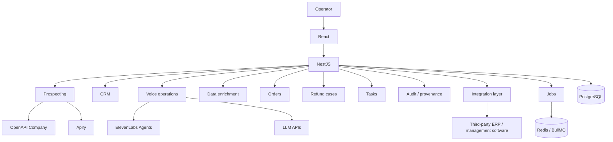

---

## Stack

**Frontend**
React · TypeScript

**Backend**
NestJS · TypeScript

**Database**
PostgreSQL

**Jobs & queues**
Redis · BullMQ

**AI & Voice**
ElevenLabs Agents · LLM APIs · Tool Calling · Structured Extraction

**Data acquisition**
Apify · OpenAPI Company

**Integrations**
REST APIs · Webhooks · Adapter Layer

**Infrastructure**
Docker

---

## Prospecting

The operator creates a campaign with sector, geography, ATECO, turnover, headcount and contact
requirements. Companies already in the CRM, or already contacted, can be excluded.

The pipeline identifies companies, completes records from the configured sources, validates,
deduplicates, scores, and moves qualified leads into the CRM. Campaign automations can insert
into the CRM, assign an owner, open follow-up tasks, build an AI call list and validate contacts.

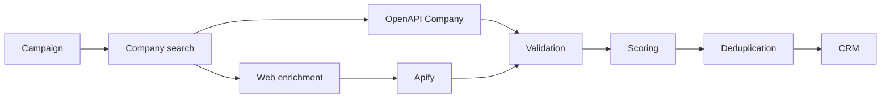

Registry data and web enrichment stay separate until validation.

Scoring uses deterministic signals first: sector, geography, revenue range, employee range,
phone, email, website, duplicate status. Semantic scoring ranks remaining candidates. It is not
stored as an official company fact.

---

## CRM

Companies, contacts, interaction history. Campaign results, calls, orders, quotes and status
changes land on the same record.

Enriched fields keep provenance. Completeness and lead score are visible on the company and
contact views.

---

## Data provenance

Acquired data keeps its source and verification status. An enriched field can carry:

| Field | |
|---|---|
| `value` | stored datum |
| `source` | system that produced it |
| `source_url` | retrieval URL, when available |
| `retrieved_at` | fetch time |
| `confidence` | pipeline confidence |
| `verification_status` | operator confirmation |
| `last_verified_at` | last confirmation |

The LLM can extract, normalise, classify and match. It does not replace the authoritative
sources. Turnover, tax identifiers and stock are not taken as true because a model produced them.

---

## AI

- classification
- structured extraction
- normalisation
- entity / company matching
- semantic scoring
- voice agent
- multi-intent detection
- tool calling
- call summaries
- conversation → structured operations (order draft, task, refund case, callback, handoff)

---

## Voice AI

```text
Incoming call
  → ElevenLabs Agent
  → Tool call
  → NestJS
  → application services / integrations
  → response
  → operation
```

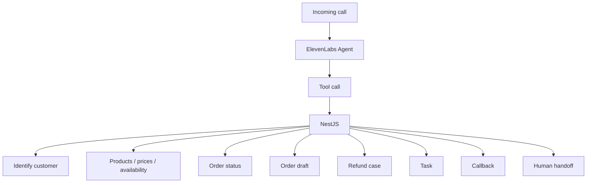

Multi-intent is the default: one conversation can emit more than one object.

```text
Call
├── Order draft
└── Refund case
```

or a task plus a live transfer. Drafts wait for operator confirmation. The agent opens a refund
case; it does not approve the refund or treat a stock lookup as a reservation.

Voice tools are NestJS endpoints: authenticated, authorised, validated, audited. The model does
not get raw credentials to ERP APIs or the database.

---

## Integrations

```text
AI / Voice Agent
  → NestJS
  → Validation
  → RBAC
  → Business rules
  → Adapter
  → External management system
```

Third-party ERP / management software sits behind the adapter. Confirmed order drafts and handled
refund cases can be synchronised after the operator signs off.

---

## Jobs

Redis / BullMQ, off the request path:

- acquisition campaigns
- enrichment
- retries and failed-job recovery
- external API calls
- long-running jobs
- sync
- webhook follow-up

---

## Access control

- RBAC on tools and records
- writes go through validation
- audit trail and structured logging
- adapter boundary around external systems
- provenance on enriched fields
- human escalation for refunds, stock-affecting orders, and anything the agent cannot complete

Client identities, private endpoints and infrastructure details are not in this repository.

---

## Screenshots

Same interfaces as the [portfolio case study](https://francescoiaforte.vercel.app/en/projects/ai-operations-hub).

| Surface | |
|---|---|
| Dashboard |  |
| Company search | 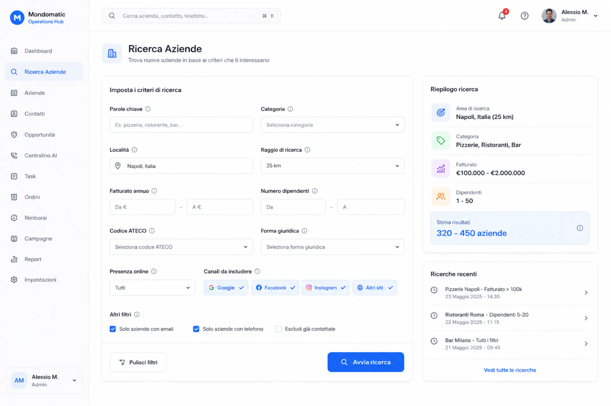 |
| Prospecting results | 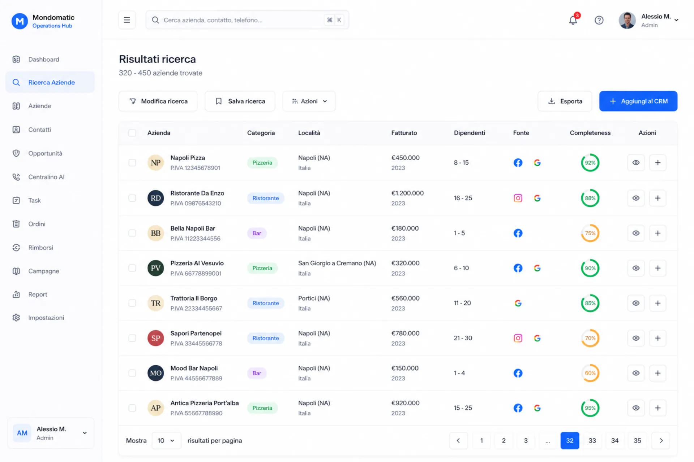 |
| Campaign | 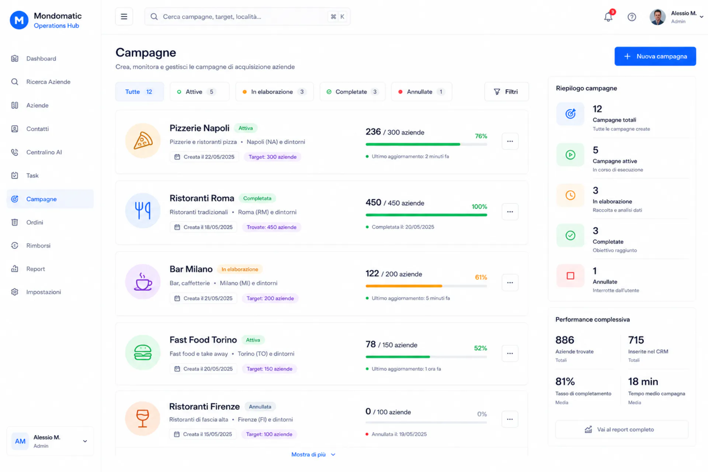 |
| Company / CRM detail | 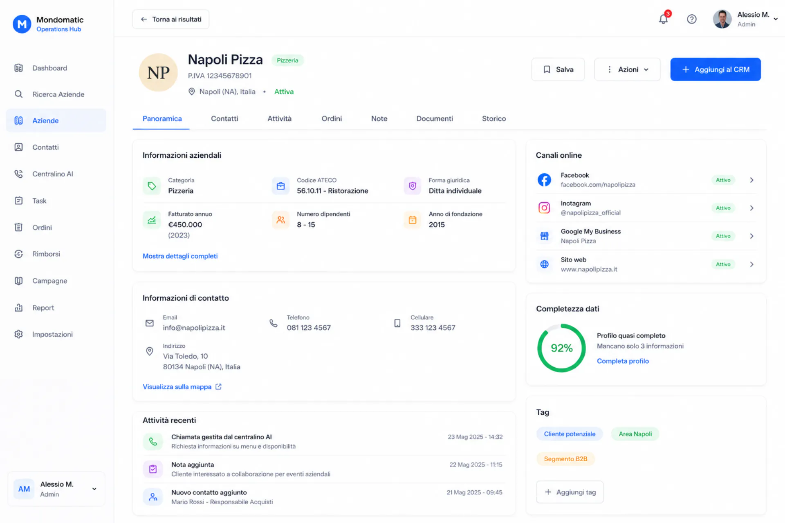 |
| AI call operations | 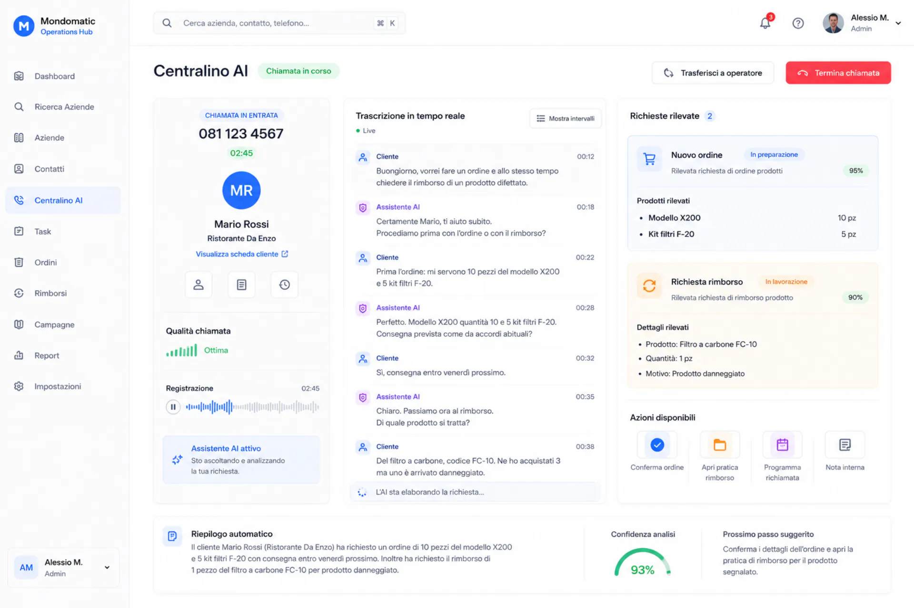 |
| Tasks | 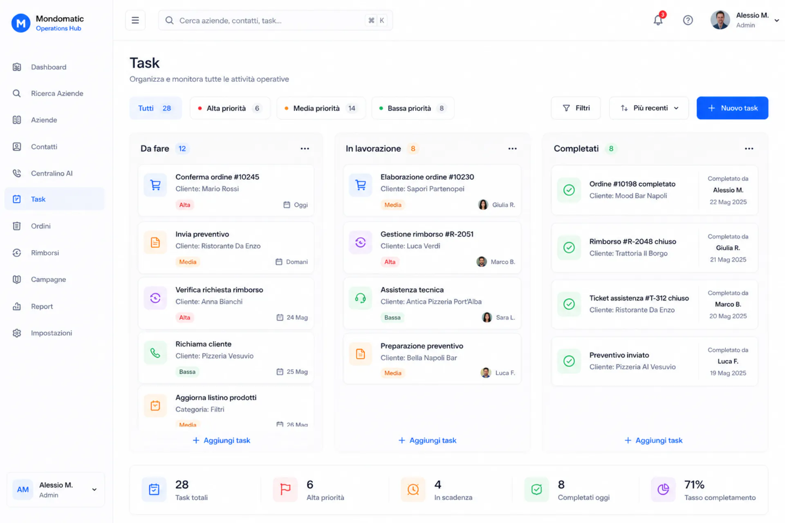 |
| Orders | 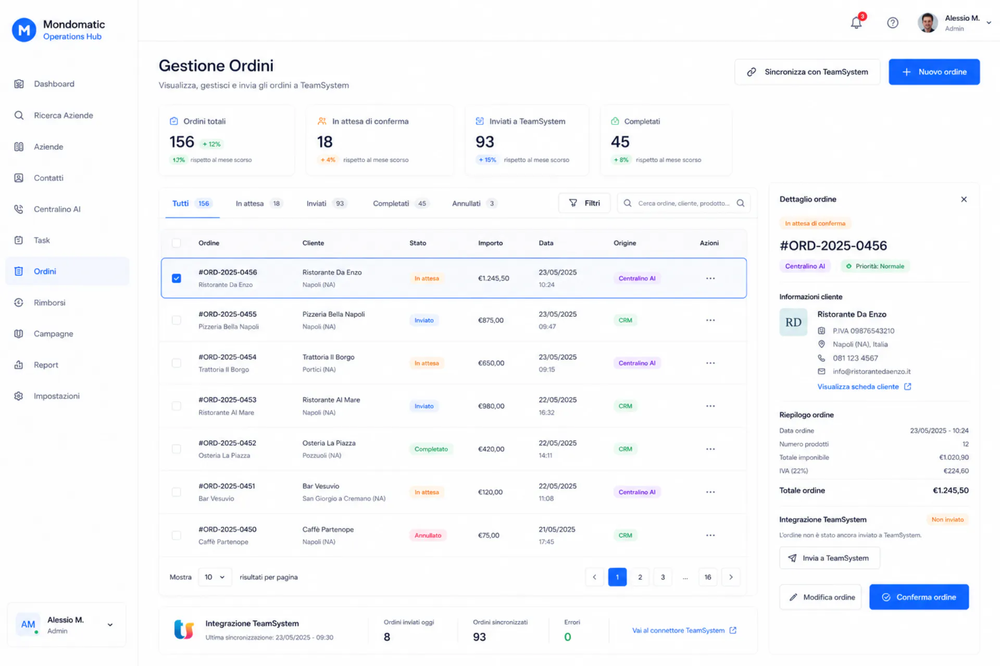 |
| Refund cases | 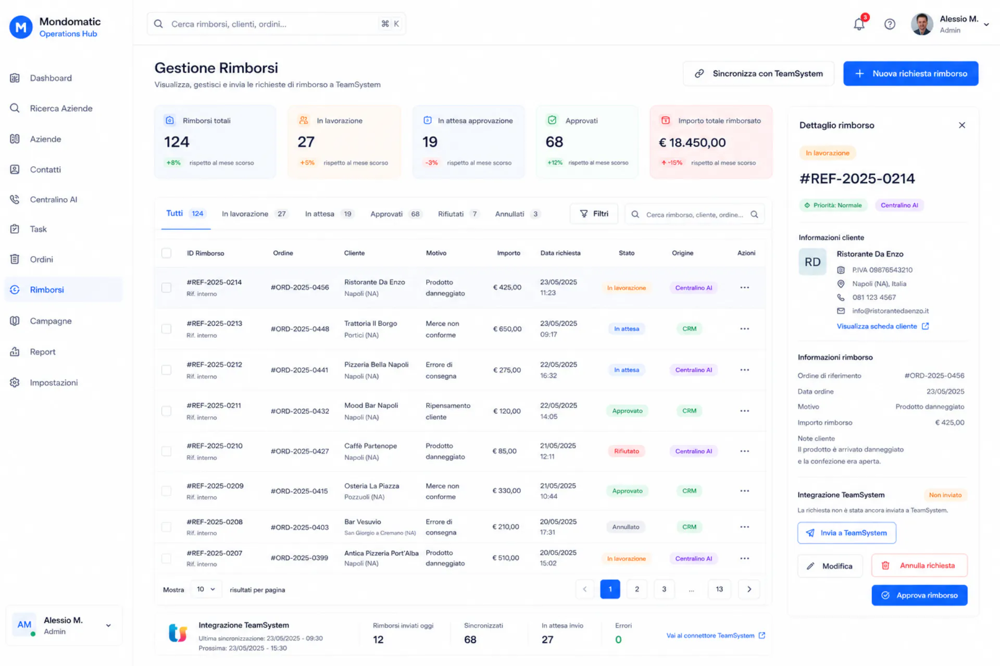 |
| Reporting | 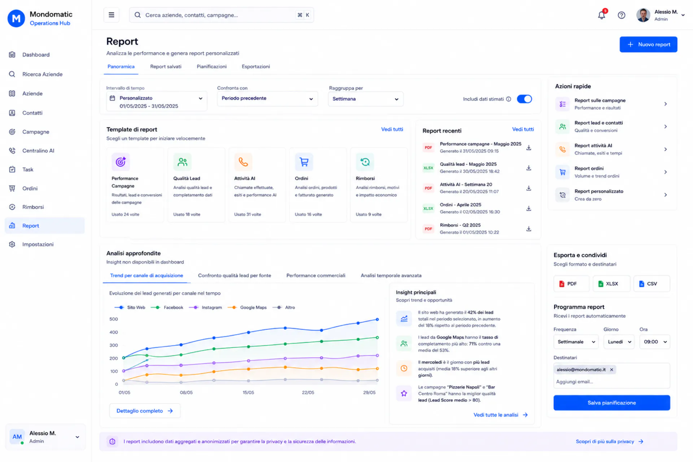 |

---

## Source code

Commercial product; source is private. This repository is the public engineering case study.

## Links

- [Interactive case study](https://francescoiaforte.vercel.app/en/projects/ai-operations-hub)
- [GitHub profile](https://github.com/francescoveryra-dot)
- [Portfolio](https://francescoiaforte.vercel.app)
